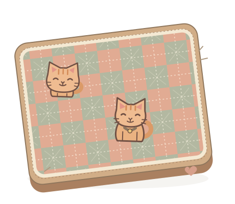
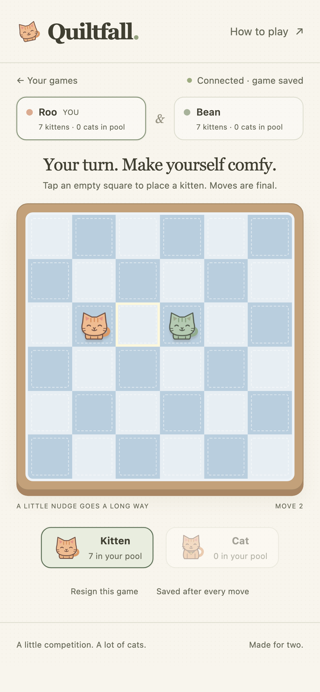
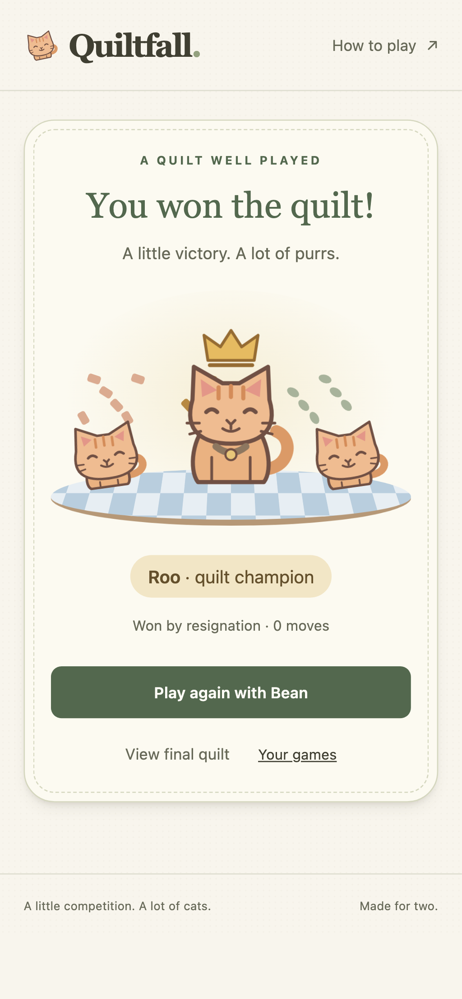

# Quiltfall

A cozy browser game for two people: cats, a patchwork quilt, and a little
friendly rivalry. Place kittens, nudge your partner off the bed, and grow a
winning line of cats. Play together on your phones, with bouncy moves and a
little victory dance.

  

  
  

**Two phones · One invite · Saved after every move**

## Start a game together

Ask one person to run the server using the [hosting guide](HOSTING.md), then
open its address in your phone's browser. Enter your name, start a game, and
send the invite link to your partner. They open it and tap **Join the quilt**.
No accounts or app installation are needed.

Use separate phones or browsers: ordinary tabs in one browser share the same
player. Keep using the same browser and server address to find your saved games.

## How to play

### Place a piece

Each player starts with **eight kittens** and takes turns placing one piece on a
**6×6 quilt**. Select **Kitten** or **Cat** from your pool, then tap an empty
square. You can only place a kind you have available. Moves are final.

### Nudge your neighbors

A newly placed piece nudges every adjacent piece **one square directly away**,
including diagonally. Kittens nudge kittens; adult cats nudge both kinds.

- A kitten cannot move an adult cat.
- If the destination is occupied, that neighbor stays put.
- All nudges happen together; they never cause another nudge.
- A piece knocked off the quilt returns to its owner's pool.

Watch for the edges: a well-placed kitten can send several neighbors tumbling!

### Grow kittens into cats

After the nudges, a straight line of **three of your pieces** graduates its
kittens into cats. Lines can be horizontal, vertical, or diagonal, and may mix
kittens and adult cats. All three pieces return to your pool as cats, ready for
later turns.

A line graduates automatically when it is the only available choice. Otherwise,
choose one highlighted group and tap **Confirm selection**.

If all **eight of your pieces** are on the quilt and at least one is a kitten,
you can instead tap a ringed kitten to retrieve and upgrade it, or tap an adult cat to return it to your pool.
You can still choose an eligible group of three. Resolve the choice before your
partner's turn begins.

### Win the quilt

Finish your own placement and nudges with either:

- **Three adult cats in a straight line**, or
- **All eight adult cats on the quilt**.

Only the player taking the turn can win. The winner gets a crowned cat and a
little celebration; both players can choose **View final quilt** to inspect the
last position. You can also resign; that gives your partner the win.

## Keep playing

Choose **Play again with your partner** after a game. Your partner accepts on
the finished-game screen, and both phones open a fresh quilt with the same
players and colors. Each player starts with eight kittens again, and the
starting player is chosen at random. No new invite link is needed.

Rematch offers survive refreshes. Your partner can decline, or you can cancel
an offer while waiting. Previous games remain in your history.

## Saves and results

Your game saves after every move. Refreshing, sleeping your phone, or restarting
the server restores the last saved board. **Your games** lists ongoing games,
finished results, games played, wins, and losses. Resignation counts as a loss;
unfinished games do not count toward results.

Your browser cookie remembers you. Clearing cookies, using a private window,
switching browsers, or changing the server hostname creates a separate identity;
a name alone cannot recover your games. Share invites privately: the first
person to explicitly join takes the second seat. If copying a link is blocked,
the app selects it for you to copy manually.

Placement, nudges, off-bed tumbles, and celebrations are animated. Your device's
**reduced motion** preference is respected.

## Run your own quilt

The [hosting guide](HOSTING.md) covers local setup, connecting two phones,
release builds, SQLite backups, configuration, troubleshooting, development
checks, and optional Fly.io deployment.

## License

Quiltfall is licensed under the [Apache License 2.0](LICENSE).
Third-party license terms are included in `web/vendor/`.
